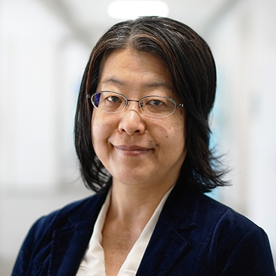
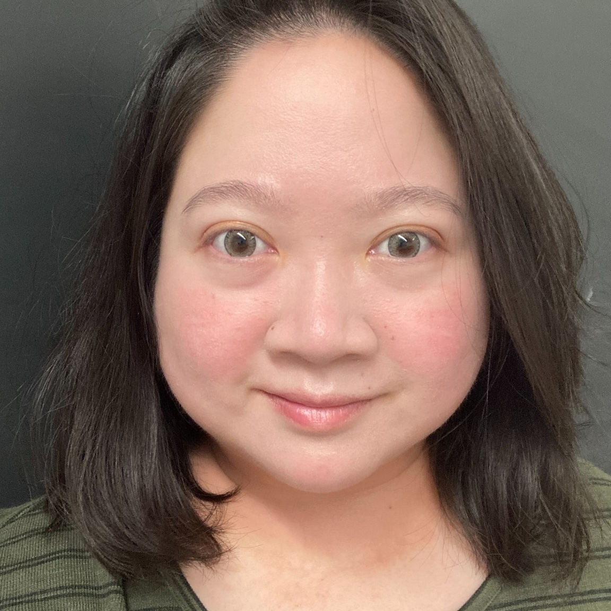

```{r setup, include=FALSE}
library(knitr)
library(readxl)
library(tidyverse)
library(leaflet)
library(DT)
library(hms)

opts_chunk$set(echo = FALSE)

```

Six years after its [inaugural meeting in 2020](https://indoling.com/inlali), the second conference of the **Indonesian Languages and Linguistics** (**InLaLi2**) will take place in Yogyakarta, under the theme **linguistic diversity of Indonesia**.

# Background

The Republic of Indonesia is home to hundreds of languages. While most of them belong to the Austronesian family, a sizable number of non-Austronesian (aka "Papuan") languages are used in the eastern part of the country, not to mention the coexistence of different sign languages. Much of this linguistic landscape still await to be investigated by both local and international linguists. As linguistics, like any other field of science, is a collaborative endeavour, it is therefore advantageous for Indonesianists to gather in the country and share their ongoing projects throughout the archipelago. In this spirit, we invite linguists all over the world to visit Yogyakarta this summer to engage in fruitful academic conversations on the linguistic diversity of Indonesia.

# Information

 * Date: 12-14 August 2026
 * Location: [Universitas Sanata Dharma](https://www.usd.ac.id/), Yogyakarta, Indonesia
 * Registration fee: 500,000 IDR (250,000 IDR for students), to be paid on site during the opening session
 * Language: English and Indonesian
   
# Keynote speakers

 * **Prof. Atsuko Utsumi** (Meisei University)<br>
{width=30%}

 * **Dr. Ekarina** (Atma Jaya Catholic University of Indonesia)<br>
{width=30%}

 * **Dr. Nurenzia Yannuar** (State University of Malang)<br>
{width=30%}

 * **Prof. Ian Joo** (Otaru University of Commerce)<br>
{width=30%}

 * **Dalan Mehuli Perangin Angin, S.S., Ph.D.** (Sanata Dharma University)<br>
{width=30%}

# Venue

**Yogyakarta** is a historic city in central Java, renowned for its deep connections to traditional Javanese culture and its proximity to numerous heritage sites. After the conference, we will organize a group tour to **Ratu Boko**, an archaeological site of Hindu and Buddhist relics, and **Borobudur**, a magnificent thousand-year-old temple representing the nation's rich Buddhist past.

**Universitas Sanata Dharma** is a leading private university in Yogyakarta, known for its strong commitment to academic excellence and its vibrant intellectual community. With modern facilities and a welcoming campus environment, it provides an ideal setting for scholarly exchange. Located in the heart of the city, the university offers convenient access to Yogyakarta’s rich cultural heritage, making it a fitting venue for discussions on the linguistic diversity of Indonesia.

The conference will be held at the [Faculty of Letters of Universitas Sanata Dharma](https://web.usd.ac.id/fakultas/sastra).

# Call for papers

<details>

<summary>See call for papers (now closed)</summary>

We invite reports of scientific research on any linguistic variety within Indonesian borders. Possible topics include:

 * Phonetics
 * Phonology
 * Syntax
 * Morphology
 * Semantics
 * Pragmatics
 * Sociolinguistics
 * Psycholinguistics
 * Neurolinguistics
 * Applied linguistics
 * Historical linguistics
 * Descriptive linguistics
 * Linguistic typology
 * Linguistic anthropology
 * Other related fields

In light of the conference theme, we especially welcome topics that highlight linguistic diversity. 

## Format
 * Language: English or Indonesian
 * Deadline: From **1 April** until **31 May** on a rolling basis: Results will be notified within two weeks after submission
   * Note: **EXTENDED UNTIL 22 JUNE**
 * Font: Times New Roman 12pt
 * Margin: 2.5cm
 * Paper size: A4
 * Length: Maximum two pages, including everything
 
## Submission
Please send your abstract in pdf format to Ian Joo at [joo@res.otaru-uc.ac.jp](mailto:joo@res.otaru-uc.ac.jp)

</details>

# Program

Program [[(pdf)](InLaLi2program.pdf)]{style="color:blue"}

```{r}
Program <- read_xlsx('InLaLi2program.xlsx') |> 
    mutate(Day = format(Day, "%m-%d"),
           Time = format(Time, "%H:%M"))

datatable(Program, rownames = FALSE, options = list(scrollX = TRUE, pageLength = 30))
```

# Registration

Please register [here](https://forms.gle/Ws6VveztC5bmmxWs7){style="color:blue"} by 31 July.


# Recommended accommodations

 * [Embe-Enem Homestay](https://embehomestay.com/) 
 * [Yellow Star Hotel](https://www.yellowstar.co.id/) 
 * [Loman Park Hotel](https://lomanparkhotel.com/)

# Organizers

 * [Ian Joo](https://ianjoo.github.io) (Otaru University of Commerce)
 * [Dalan Mehuli Perangin-Angin](https://www.usd.ac.id/detail_dosen.php?id=02253) (Universitas Sanata Dharma)
 * [Katharina E. Sukamto](https://scholar.google.com/citations?user=bki4PHgAAAAJ) (Atma Jaya Catholic University)
 * [Gede Primahadi Rajeg](https://scholar.google.com/citations?user=ucWpoVEAAAAJ) (Udayana University)
 * [Nurenzia Yannuar](https://linguistics-fib.ub.ac.id/nurenzia-yannuar-ph-d/) (Universitas Negeri Malang)
 * [Nazarudin](https://scholar.google.com/citations?user=Nu-j08wAAAAJ) (Universitas Indonesia)
