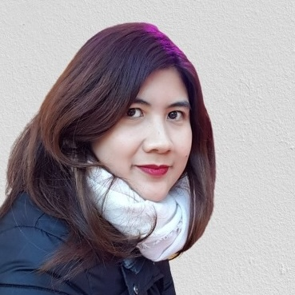
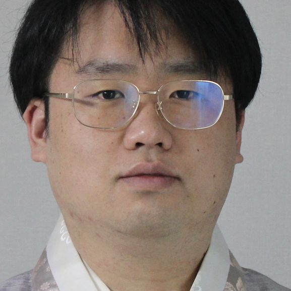
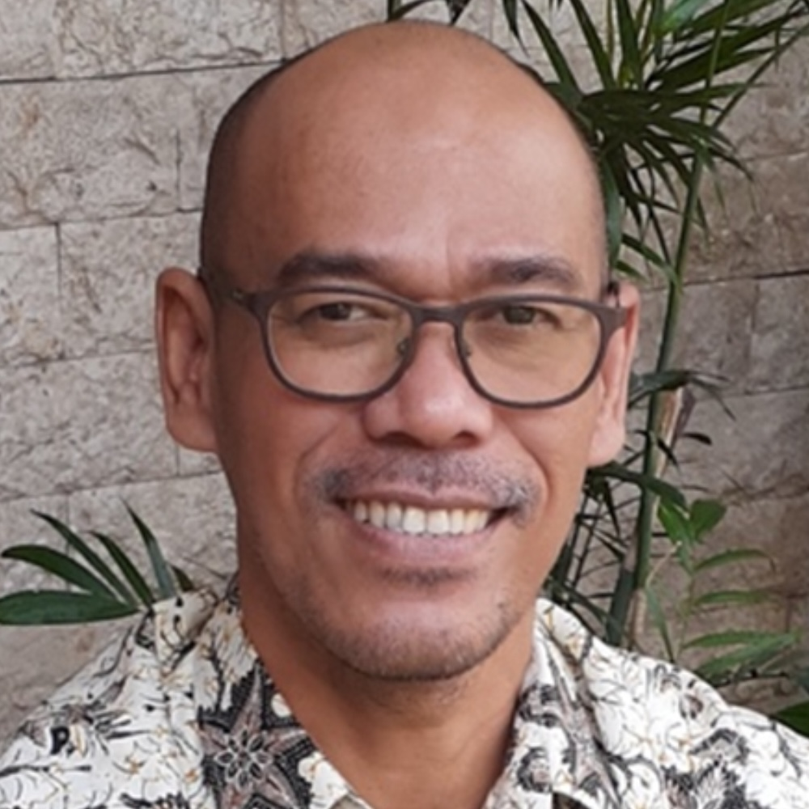

  
```{r setup, include=FALSE}
library(knitr)
library(readxl)
library(tidyverse)
library(leaflet)
library(DT)
library(hms)

opts_chunk$set(echo = FALSE)
```

Enam tahun setelah [pertemuan perdananya pada tahun 2020](https://indoling.com/inlali), konferensi kedua **Bahasa dan Linguistik Indonesia** (**InLaLi2**) akan berlangsung di Yogyakarta, dengan tema **keragaman bahasa Indonesia**.

# Latar Belakang

Republik Indonesia adalah rumah bagi ratusan bahasa. Meskipun sebagian besar termasuk dalam rumpun bahasa Austronesia, sejumlah besar bahasa non-Austronesia (atau "Papua") digunakan di bagian timur negara ini, belum lagi keberadaan berbagai bahasa isyarat. Sebagian besar lanskap linguistik ini masih menunggu untuk diteliti oleh para ahli bahasa lokal dan internasional. Karena linguistik, seperti bidang ilmu lainnya, merupakan upaya kolaboratif, maka akan menguntungkan bagi para ahli Indonesia untuk berkumpul di negara ini dan berbagi proyek-proyek mereka yang sedang berjalan di seluruh kepulauan. Dengan semangat ini, kami mengundang para ahli bahasa dari seluruh dunia untuk mengunjungi Yogyakarta pada musim panas ini untuk terlibat dalam percakapan akademis yang bermanfaat tentang keragaman linguistik Indonesia.

# Informasi

* Tanggal: 12-14 Agustus 2026
* Lokasi: [Universitas Sanata Dharma](https://www.usd.ac.id/), Yogyakarta, Indonesia
* Biaya pendaftaran: 500.000 IDR (250.000 IDR untuk mahasiswa), pembayaran dilakukan di tempat selama sesi pembukaan.
* Bahasa: Inggris dan Indonesia

# Pembicara kunci

 * **Prof. Atsuko Utsumi** (Universitas Meisei) <br>
{width=30%}

 * **Dr. Ekarina** (Universitas Atma Jaya Jakarta) <br>
{width=30%}

 * **Dr. Nurenzia Yannuar** (Universitas Negeri Malang)<br>
{width=30%}


 * **Prof. Ian Joo** (Universitas Perdagangan Otaru)<br>
{width=30%}

 * **Dalan Mehuli Perangin Angin, S.S., Ph.D.** (Universitas Sanata Dharma)<br>
{width=30%}

# Tempat

**Yogyakarta** adalah kota bersejarah di Jawa Tengah, terkenal karena hubungannya yang erat dengan budaya tradisional Jawa dan kedekatannya dengan banyak situs warisan budaya. Setelah konferensi, kami akan mengadakan tur kelompok ke **Ratu Boko**, sebuah situs arkeologi yang memuat peninggalan Hindu dan Buddha, serta **Borobudur**, sebuah candi megah berusia seribu tahun yang mencerminkan kekayaan warisan Buddha di negeri ini.

**Universitas Sanata Dharma** adalah universitas swasta terkemuka di Yogyakarta, yang dikenal karena komitmennya yang kuat terhadap keunggulan akademik dan komunitas intelektualnya yang dinamis. Dengan fasilitas modern dan lingkungan kampus yang ramah, universitas ini menyediakan tempat yang ideal untuk pertukaran ilmiah. Terletak di jantung kota, universitas ini menawarkan akses mudah ke warisan budaya Yogyakarta yang kaya, menjadikannya tempat yang tepat untuk diskusi tentang keragaman linguistik Indonesia.

Konferensi ini akan diselenggarakan di [Fakultas Sastra Universitas Sanata Dharma](https://web.usd.ac.id/fakultas/sastra).

# Undangan pengajuan makalah

<details>

<summary>Lihat pengajuan makalah (telah ditutup)</summary>

Kami mengundang laporan penelitian ilmiah tentang berbagai variasi linguistik di Indonesia. Topik yang mungkin termasuk:
  
 * Fonetik
 * Fonologi
 * Sintaksis
 * Morfologi
 * Semantik
 * Pragmatik
 * Sosiolinguistik
 * Psikolinguistik
 * Neurolinguistik
 * Linguistik terapan
 * Linguistik historis
 * Linguistik deskriptif
 * Tipologi linguistik
 * Antropologi linguistik
 * Bidang terkait lainnya

Mengingat tema konferensi, kami sangat menyambut topik yang menyoroti keragaman linguistik.

## Format

 * Bahasa: Inggris atau Indonesia
 * Batas Waktu: Mulai **1 April** hingga **31 Mei** secara bertahap: Hasil akan diberitahukan dalam waktu dua minggu setelah pengiriman
   * Catatan: **DIPERPANJANG HINGGA 22 JUNI**
 * Font: Times New Roman 12pt
 * Margin: 2,5 cm
 * Ukuran Kertas: A4
 * Panjang: Maksimum dua halaman, termasuk semuanya

## Pengiriman
Silakan kirim abstrak Anda dalam format pdf ke Ian Joo di [joo@res.otaru-uc.ac.jp](mailto:joo@res.otaru-uc.ac.jp)

</details>

# Program

Program [[(pdf)](InLaLi2program.pdf)]{style="color:blue"}

```{r}
Program <- read_xlsx('InLaLi2program.xlsx') |> 
    mutate(Day = format(Day, "%m-%d"),
           Time = format(Time, "%H:%M"))

datatable(Program, rownames = FALSE, options = list(scrollX = TRUE, pageLength = 40))
```

# Registrasi

Silakan daftar di [sini](https://forms.gle/Ws6VveztC5bmmxWs7){style="color:blue"} sebelum 31 Juli.

# Akomodasi yang direkomendasikan

 * [Embe-Enem Homestay](https://embehomestay.com/) 
 * [Yellow Star Hotel](https://www.yellowstar.co.id/) 
 * [Loman Park Hotel](https://lomanparkhotel.com/)

# Penyelenggara

 * [Ian Joo](https://ianjoo.github.io) (Universitas Perdagangan Otaru)
 * [Dalan Mehuli Perangin-Angin](https://www.usd.ac.id/detail_dosen.php?id=02253) (Universitas Sanata Dharma)
 * [Katharina E. Sukamto](https://scholar.google.com/citations?user=bki4PHgAAAAJ) (Universitas Katolik Indonesia Atma Jaya)
 * [Gede Primahadi Rajeg](https://scholar.google.com/citations?user=ucWpoVEAAAAJ) (Universitas Udayana)
 * [Nurenzia Yannuar](https://linguistics-fib.ub.ac.id/nurenzia-yannuar-ph-d/) (Universitas Negeri Malang)
 * [Nazarudin](https://scholar.google.com/citations?user=Nu-j08wAAAAJ) (Universitas Indonesia)